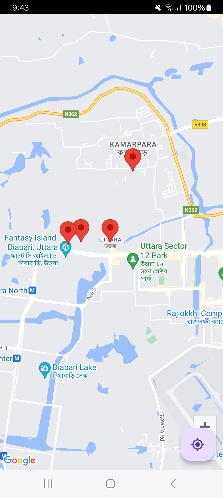

# Map app with Flutter Dart and Firebase

## This   project is for u 
**It's a**


## Features
 * **Pace :**
  - Deatailed view
  - Recomendations


## File structure

    
    ├── lib
    │   ├── main.dart                  
     
 
 
</br>

 
 


 

## Run Locally

Clone the project

```bash
  git clone https://github.com/abdulawalarif/google_map.git
```


Go to the project directory

```bash
  cd google_map
```

Install dependencies

```bash
  flutter pub get
```

Connect a physical device or start a virtual device on your machine

```bash
  flutter run
```


## How to tweak this project for your own uses
* **Setup Map API:** Add map apikey..


 

## Reporting Bugs or Requesting Features?

If you found an issue or would like to submit an improvement to this project,
please submit an issue using the issues tab above. If you would like to submit a PR with a fix, reference the issue you created!

##  Known Issues and Future Work
* **Some Issues are herer:** There must be some issu to always improve and prove that i am also a human but dart and black.
 

## Author

- [@abdulawalarif](https://github.com/abdulawalarif) 
 
  
## License


The MIT License [MIT](https://choosealicense.com/licenses/mit/). Please view the [License](LICENSE) File for more information.